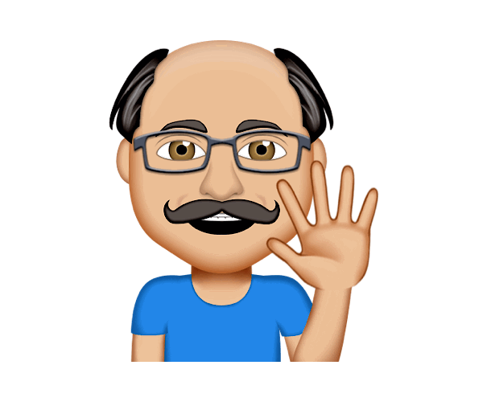

# Galvan the bot!

### My Nmae is Galvan!
### start chatting with me on fb message!  https://www.facebook.com/galvanthebot/

#### Q2 project

What is a chatbot?
it’s automated response from anyone that try to message you.
from any topics you think of.

Bot is a software that automates things that we do.
----------------------------------------
### Why this is necessary?
*	people spend 80% of time in just 3 apps a da
*	9 out of 10 top used apps were made by Google and Facebook.
----------------------------------------
### What my bots can do?
1.	Get customized notifications and news. A bot can act as a smart newspaper, sending you relevant content as soon as it's published.

2.	Integrate with other services. A bot can enrich chats with content from external services like IMDB, Wiki, YouTube, GitHub, Foursquare....

3.	Create custom tools. A bot may provide you with alerts, weather forecasts, translations, formatting or other services.

4.	Build single and multiplayer games. A bot can play chess and checkers against you, act as host in quiz games, or even take up the dungeon master's dice for an RPG.

5.	Build social services. A bot could connect people looking for conversation partners based on common interests or proximity.

6.	Do virtually anything else. Except for time travel. They just can't do it. Yet!

7.	In this course we're making a simple bot that can answer questions on your behalf and have a simple dialog with people.
